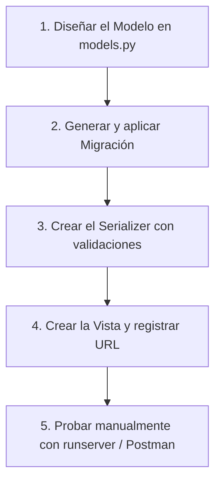

# 📚 Guía de Uso del Repositorio y Asistentes de IA

Bienvenido a la plantilla de desarrollo backend con **Python, Django y Django REST Framework (DRF)** para estudiantes.

Este repositorio está configurado con un ecosistema de **Inteligencia Artificial Guiada** diseñado para ayudarte a **aprender a programar paso a paso**, en lugar de simplemente copiar código automático.

---

## 🎯 ¿Por qué usar esta plantilla?

1. **Aprendizaje Activo (Tutor 24/7):** La IA está configurada bajo una regla estricta: **no te dará la solución completa de inmediato**. Te explicará el concepto, te dará una plantilla base con `# TODO:` y te desafiará a que escribas el código tú mismo, dándote retroalimentación en cada intento.
2. **Arquitectura Profesional:** Te enseña a estructurar una API en capas limpias (Modelos, Serializadores, Servicios y Vistas).
3. **Resolución de Errores Guiada:** Te enseña a interpretar los errores de la terminal (tracebacks de Django) en lugar de frustrarte.

---

> ⚠️ **Regla importante: nunca pegues tu código en el chat.** Cuando quieras que la IA revise lo que escribiste, dile en qué archivo lo hiciste (ej. `apiGit/models.py`) y déjala abrirlo y leerlo directamente desde el repositorio. Así la revisión se hace sobre el código real y guardado, no sobre un fragmento copiado que puede estar desactualizado.

---

## 💻 ¿Qué hacer al abrir la IA por primera vez?

Dependiendo de la herramienta que utilices en tu computador:

### 1. En el Editor (VS Code / Cursor)
* **Con GitHub Copilot:**
  - Abre el panel de chat (`Ctrl + Alt + I`).
  - Puedes llamar a los agentes usando `@`: `@Mentor`, `@DRF Developer` o `@Debug`.
  - Puedes invocar comandos usando `/`: `/create-model`, `/create-serializer`.
* **Con Cursor o Antigravity:**
  - Abre el chat (`Ctrl + L`).
  - La IA ya leyó automáticamente [`AGENTS.md`](AGENTS.md). Simplemente dile en qué rol quieres que te ayude:
    > *"Actúa como Mentor. Necesito crear el modelo de Estudiantes, dame la estructura básica con comentarios para que yo lo programe."*

### 2. En la Consola / CLI (Claude Code, Gemini CLI)
* Al ejecutar el comando en la terminal de la carpeta del proyecto, el CLI lee automáticamente [`CLAUDE.md`](CLAUDE.md) o [`GEMINI.md`](GEMINI.md).
* Tu primer mensaje puede ser tan simple como:
  > *"Hola, soy estudiante de INACAP. Vamos a desarrollar una nueva API. Por favor sigue la regla de AGENTS.md: no me des el código terminado, explícame y guíame para que yo lo escriba."*

---

## 🚀 Inicio Rápido: El Entorno Virtual

El proyecto cuenta con su propio entorno virtual preinstalado en la carpeta `vgit`. Utiliza siempre este ejecutable para correr comandos:

```powershell
# 1. Comprobar que Django no tiene errores de configuración:
.\vgit\Scripts\python.exe manage.py check

# 2. Aplicar las migraciones a la base de datos local SQLite:
.\vgit\Scripts\python.exe manage.py migrate

# 3. Levantar el servidor de desarrollo:
.\vgit\Scripts\python.exe manage.py runserver
```

---

## 🤖 Los Agentes Especializados (`.ai/agents/`)

En lugar de interactuar con una IA genérica, puedes pedirle al asistente que adopte un "rol" o sombrero específico:

| Agente | Archivo | ¿Para qué sirve? | Ejemplo de cómo pedirlo |
| :--- | :--- | :--- | :--- |
| **Mentor** | [mentor.md](.ai/agents/mentor.md) | **El tutor pedagógico.** Explica conceptos paso a paso, evalúa tu código y te desafía con ejercicios. | *"Actúa como Mentor. Explícame qué es un ModelSerializer y dame un ejercicio para practicar."* |
| **DRF Developer** | [drf-developer.md](.ai/agents/drf-developer.md) | **El programador senior.** Conoce los estándares de código, endpoints REST, códigos de estado y buenas prácticas. | *"Actúa como DRF Developer. Revisa este ViewSet que escribí y dime si cumple las buenas prácticas."* |
| **Django Architect**| [django-architect.md](.ai/agents/django-architect.md)| **El diseñador de base de datos.** Ayuda a modelar relaciones complejas (`ForeignKey`, `ManyToMany`), índices y tablas. | *"Actúa como Architect. Necesito relacionar Alumnos con Cursos, ¿qué tipo de relación me recomiendas y por qué?"* |
| **Debug** | [debug.md](.ai/agents/debug.md) | **El detective de errores.** Analiza tracebacks, fallos de migraciones y consultas lentas en la base de datos. | *"Actúa como Debug. Me salió este error en la consola: `[pegar error]`. Explícame qué significa y cómo resolverlo."* |

---

## 🧠 Habilidades y Buenas Prácticas (`.ai/skills/`)

Son guías técnicas detalladas que la IA consulta para responderte con el estándar del proyecto. Tú también puedes leerlas cuando estudies:

* [**`ways-of-working.md`**](.ai/skills/ways-of-working.md): El manual operativo del repositorio y el *Definition of Done* (criterios para dar por terminada una tarea).
* [**`django-orm.md`**](.ai/skills/django-orm.md): Cómo diseñar modelos limpios, definir `__str__` y evitar consultas lentas (problema N+1).
* [**`drf-serializers.md`**](.ai/skills/drf-serializers.md): Cómo validar datos de entrada (validación de campos individuales y entre campos).
* [**`drf-views.md`**](.ai/skills/drf-views.md): Cuándo usar `ModelViewSet`, `GenericAPIView` o `APIView`.
* [**`django-services.md`**](.ai/skills/django-services.md): Arquitectura limpia (separar lógica en `services.py` y lecturas en `selectors.py`).
* [**`drf-auth-permissions.md`**](.ai/skills/drf-auth-permissions.md): Cómo proteger endpoints con autenticación y permisos.

---

## ⚡ Plantillas de Código Rápido (`.vscode/__templates__/`)

Para no empezar archivos desde cero, tienes plantillas listas compatibles con la extensión **Code Template Tool**:

1. **`django-model`**: Crea un modelo ORM con campos básicos, ordenamiento y `Meta`.
2. **`drf-serializer`**: Crea un serializador con validaciones listas para completar.
3. **`drf-viewset`**: Crea un `ModelViewSet` con permisos configurados.
4. **`django-service`**: Crea una función de servicio con transacción atómica (`@transaction.atomic`).

> 💡 **Tip:** Si no tienes la extensión instalada, puedes consultar el archivo [**`exemplars.md`**](exemplars.md), que contiene ejemplos completos de código listos para copiar y adaptar.

---

## 📋 ¿Qué es la carpeta `specs/` (OpenSpec) y para qué sirve?

La carpeta [`specs/`](specs/) implementa la metodología **Spec-Driven Development (SDD)** mediante el estándar [OpenSpec](https://openspec.dev).

### ¿Qué problema resuelve?
En proyectos de estudio o profesionales, cuando un equipo empieza a programar directamente sin planificar:
* No queda claro qué hace exactamente cada funcionalidad.
* Un compañero programa algo que rompe lo que hizo otro.
* Nadie documenta la API y al final del semestre no recuerdan los requerimientos originales.

**`specs/` es la memoria viva y el plano de construcción del proyecto.**

### Estructura de la carpeta `specs/`:
```text
specs/
├── project.md           # Descripción general del proyecto (stack, convenciones y calidad)
├── specs/               # LA VERDAD VIVA: Qué funcionalidades YA están construidas
│   └── <modulo>/spec.md # Requerimientos y casos de prueba (GIVEN / WHEN / THEN)
└── changes/             # PROPUESTAS DE CAMBIO: Lo que se está planeando o construyendo
    ├── <nombre-cambio>/ # Propuesta activa (como una rama o branch)
    └── archive/         # Decisiones históricas ya terminadas y archivadas
```

### ¿Cómo funciona el ciclo de una `spec`?
Funciona de manera muy similar a las **migraciones de base de datos**:

1. **`proposal.md` (La Propuesta):** Defines qué quieres construir y por qué (ej. `add-grades-api`).
2. **`design.md` (El Diseño Técnico):** Se define qué modelos, campos y endpoints se van a crear.
3. **`tasks.md` (Lista de Tareas):** Se divide el trabajo en pasos pequeños enfocados en pruebas (Test-First).
4. **Implementación:** Se programa el código y se corren los tests.
5. **Archivo (`archive`):** Una vez que todo pasa las pruebas, el cambio se archiva y la documentación viva de `specs/specs/` se actualiza automáticamente.

### ¿Cómo pedirle a la IA que use `specs`?
Si tienen que desarrollar una entrega grande o un módulo nuevo:
> *"Queremos planificar el módulo de 'Inscripción de Asignaturas'. Actúa como Django Architect y usa el flujo `/spec-propose` para definir los requerimientos y el diseño antes de escribir código."*

Esto les dará un documento de diseño profesional que pueden adjuntar en sus informes de entrega o defensas de proyecto.

---

## 🔄 El Flujo Recomendado para Cada Tarea

Cada vez que te pidan implementar una nueva funcionalidad (por ejemplo: *"Módulo de Profesores"*), sigue este orden:



### Ejemplo de interacción en el Chat:

1. **Pides ayuda:** *"Queremos crear el modelo para 'Profesor' con nombre, especialidad y email. Actúa como Mentor y guíanos con la estructura inicial."*
2. **La IA te responde:** Te explica qué tipos de campos usar (`CharField`, `EmailField`) y te da una plantilla con `# TODO:`.
3. **Tú escribes el código:** Abres `apiGit/models.py` y redactas el modelo, y guardas el archivo.
4. **Le pides retroalimentación (sin copiar y pegar):** Solo dile qué archivo tocaste: *"Ya escribí el modelo en `apiGit/models.py`, revísalo directamente en el repositorio y dime si está correcto o falta alguna buena práctica."* La IA abre y lee el archivo real desde tu proyecto — no necesitas pegar el código en el chat.
5. **La IA te corrige** citando el archivo y la línea exacta, y avanzas al siguiente paso.
