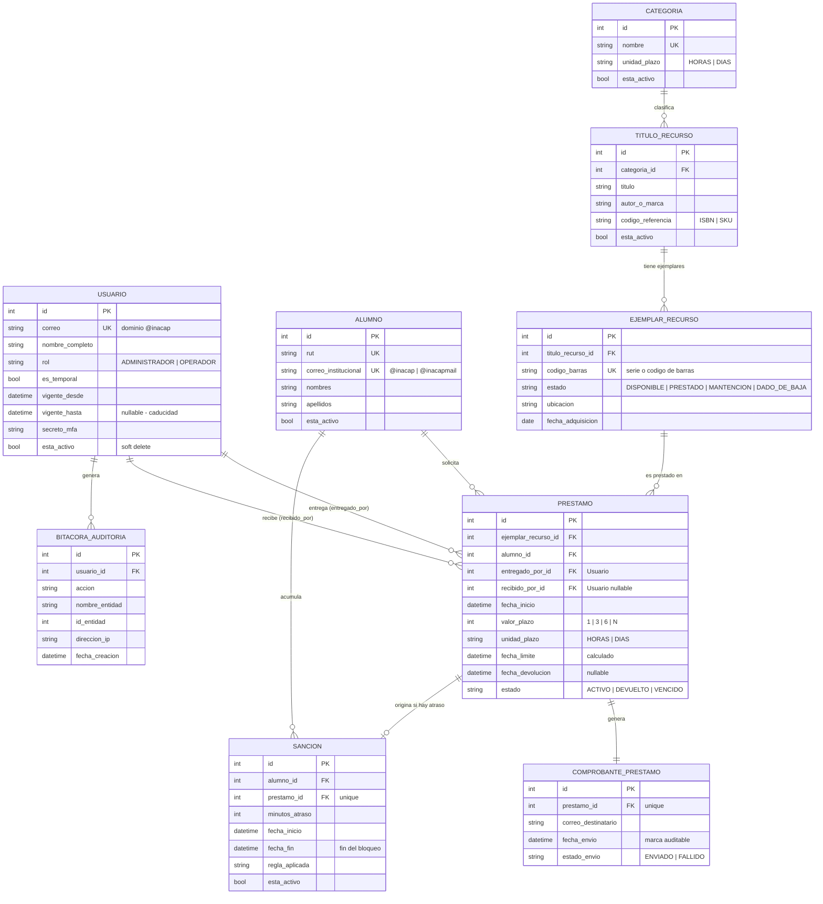

# Análisis Preliminar — Sistema de Gestión de Biblioteca (INACAP)

## Tabla de Contenidos

**Parte A — Análisis conceptual**

1. [Qué problema busca resolver el sistema](#1-qué-problema-busca-resolver-el-sistema)
2. [Principales usuarios o actores](#2-principales-usuarios-o-actores)
3. [Funcionalidades principales](#3-funcionalidades-principales)
4. [Información que deberá almacenar](#4-información-que-deberá-almacenar)
5. [Entidades principales del sistema](#5-entidades-principales-del-sistema)
6. [Relaciones entre las entidades](#6-relaciones-entre-las-entidades)

**Parte B — Diseño preliminar**

7. [Modelo preliminar de datos](#7-modelo-preliminar-de-datos)
8. [Principales clases o modelos Django](#8-principales-clases-o-modelos-django)
9. [Relaciones entre entidades a nivel Django](#9-relaciones-entre-entidades-a-nivel-django)
10. [Operaciones principales del sistema](#10-operaciones-principales-del-sistema)
11. [Propuesta inicial de endpoints](#11-propuesta-inicial-de-endpoints)
12. [Consultas ORM necesarias](#12-consultas-orm-necesarias)

---

# Parte A — Análisis conceptual

## 1. Qué problema busca resolver el sistema

La biblioteca de la institución **no tiene ningún sistema de gestión**. El único intento fue una
planilla Excel hoy completamente desactualizada, que no refleja el stock real. De ahí se derivan
cinco problemas concretos:

| # | Problema actual | Consecuencia |
| - | --------------- | ------------ |
| P1 | No hay claridad del stock real de libros ni de equipos tecnológicos (tablets, audífonos, accesorios). | Pérdidas de inventario sin detección ni responsable. |
| P2 | No existe trazabilidad: no se sabe quién tiene un recurso, por cuánto tiempo ni cuándo debe devolverlo. | Imposible recuperar material ni auditar movimientos. |
| P3 | Los 4 bibliotecarios trabajan en **turnos rotativos** y no comparten un registro común. | Inconsistencias de información entre un turno y otro. |
| P4 | Las sanciones por atraso se aplican de forma "moral" o subjetiva, según criterio y memoria del operador de turno. | Trato desigual entre alumnos, sin respaldo ni período definido. |
| P5 | La hora límite de devolución se comunica **solo de palabra**. | El alumno la olvida y el personal no puede demostrar que se le avisó. |

Hay además un problema de **control de accesos**: existen ayudantes y trabajadores temporales
(alumnos en práctica o apoyo) cuya rotación hace imposible saber quién debería seguir teniendo
acceso al sistema.

### Solución propuesta

Un **sistema web de uso interno exclusivo para el personal de biblioteca** (bibliotecarios,
operadores de mesón y administradores) que cubra:

- **Inventariado inicial desde cero** y catalogación de libros y equipos → resuelve P1.
- **Registro de préstamos y devoluciones firmado por el operador en turno** → resuelve P2 y P3.
- **Motor de sanciones automáticas** basado en reglas fijas → resuelve P4.
- **Comprobante digital enviado al correo institucional del alumno** con la hora límite exacta y
  marca temporal auditable → resuelve P5.
- **Cuentas temporales con fecha de caducidad automática** y borrado lógico (*soft delete*)
  → resuelve el control de accesos.

> **Fuera del alcance:** portal de autoservicio o login para alumnos (la aplicación es 100 % para
> operadores de mesón).

---

## 2. Principales usuarios o actores

| Actor | Tipo | Qué hace en el sistema | Nivel de acceso |
| ----- | ---- | ---------------------- | --------------- |
| **Administrador / Jefe de Biblioteca** | Directo | Crea otros administradores, gestiona operadores permanentes y temporales, define vigencias, desactiva cuentas (soft delete), consulta reportes globales y la bitácora. | Superusuario. Control total. |
| **Bibliotecario / Operador de Turno** | Directo | Registra entregas y devoluciones, consulta stock real en mesón, revisa antecedentes del alumno. Cada acción queda firmada con su identificador. | Operador permanente. |
| **Operador Temporal / Estudiante en Apoyo** | Directo | Mismas operaciones de mesón, pero con **cuenta de expiración programada**: al vencer la fecha, el sistema revoca el acceso automáticamente. | Operador con vigencia limitada. |
| **Estudiante / Alumno Solicitante** | **Indirecto** | **No interactúa con la aplicación.** Entrega sus datos en el mesón (correo `@inacap` / `@inacapmail` o RUT) y **recibe** el comprobante digital en su correo. | Ninguno (sin login). |
| **Equipo de TI y Ciberseguridad** | Indirecto | Valida políticas de autenticación institucional, MFA y retención de logs. | Ninguno (rol de gobierno). |

---

## 3. Funcionalidades principales

Agrupadas en los 4 módulos del SRS, con su requerimiento funcional asociado:

### Módulo 1 — Autenticación, roles y gestión de usuarios

- **RF-01 — Autenticación de personal con `@inacap` + MFA.** Solo dominio `@inacap`; obligatorio
  usuario, contraseña y código TOTP de 6 dígitos.
- **RF-02 — Gestión de administradores y operadores con soft delete.** Al desactivar,
  `is_active = False`: bloquea el login pero **preserva el nombre en el histórico de préstamos**
  que ese operador registró.
- **RF-03 — Cuentas temporales con expiración automática.** Campo opcional "Fecha de caducidad";
  llegada la fecha, el sistema impide el login sin intervención manual.

### Módulo 2 — Catálogo e inventariado inicial

- **RF-04 — Inventariado inicial y nuevas entradas.** Levantamiento desde cero; cada ejemplar
  físico con su número de serie o código de barras propio; permite agregar nuevas categorías de
  equipos sin restricciones rígidas.
- **RF-05 — Catálogo operativo para mesón.** Vistas filtrables por categoría y producto, con stock
  total y disponibilidad **en tiempo real**: un recurso prestado cambia de inmediato a "Prestado".

### Módulo 3 — Préstamos, plazos y comprobante

- **RF-06 — Registro de préstamo con plazos predefinidos.** Alumno identificado por correo
  institucional o RUT; plazo obligatorio (1 h, 3 h o 6 h para equipos; días para libros); valida
  que el alumno no tenga sanciones vigentes ni préstamos vencidos; registra el operador en sesión.
- **RF-07 — Comprobante digital automático.** Envío al correo del alumno con artículo, fecha/hora
  de inicio y hora límite exacta, guardando **marca de auditoría (timestamp) del despacho**.

### Módulo 4 — Devoluciones y sanciones

- **RF-08 — Registro de devolución en mesón.** Actualiza el estado a disponible, guarda la hora
  real de retorno y el operador que recibió.
- **RF-09 — Motor de sanciones automáticas.** Calcula algorítmicamente la fecha/hora de fin del
  bloqueo según el retraso y bloquea todo nuevo préstamo durante el castigo.

### Transversal

- **Bitácora inmutable de auditoría** (RNF-05): usuario, acción, fecha, hora e IP de cada
  movimiento de inventario, préstamo y devolución.
- **Reportes de inventario y alertas de ítems vencidos por turno.**

---

## 4. Información que deberá almacenar

| Grupo | Datos concretos |
| ----- | --------------- |
| **Usuarios del sistema** | Correo `@inacap` (identificador de login), nombre, rol (administrador / operador), secreto MFA (TOTP), estado activo (soft delete), tipo de cuenta (permanente / temporal), fecha de inicio y **fecha de caducidad** de vigencia, fecha de creación, último acceso. |
| **Alumnos** | RUT, correo institucional (`@inacap` o `@inacapmail`), nombre y apellido, carrera o sede (opcional), estado derivado de bloqueo por sanciones. |
| **Categorías de recurso** | Nombre (Libro, Tablet, Audífono, Accesorio…), unidad de plazo aplicable (horas / días), si está activa. *Debe ser extensible sin tocar el código (RNF-04).* |
| **Títulos / productos del catálogo** | Categoría, título o modelo, autor o marca, ISBN o código de producto, editorial o fabricante, año, descripción. |
| **Ejemplares físicos** | Título al que pertenece, **código de barras o número de serie único**, estado (disponible / prestado / en mantención / dado de baja), ubicación o estante, fecha de alta en inventario. |
| **Préstamos** | Ejemplar, alumno, **operador que entregó**, **operador que recibió**, fecha/hora de inicio, plazo seleccionado (1 h / 3 h / 6 h / N días), **fecha/hora límite calculada**, fecha/hora real de devolución, estado (activo / devuelto / vencido), observaciones. |
| **Comprobantes** | Préstamo asociado, correo destino, **timestamp de despacho**, estado del envío (enviado / fallido), contenido o referencia del mensaje. |
| **Sanciones** | Alumno, préstamo que la originó, minutos de atraso, fecha/hora de inicio y **fin del bloqueo**, regla aplicada, estado (vigente / cumplida). |
| **Bitácora de auditoría** | Usuario operador, acción realizada, entidad y registro afectado, fecha, hora e **IP**. |

---

## 5. Entidades principales del sistema

| # | Entidad | Rol en el dominio |
| - | ------- | ----------------- |
| E1 | **Usuario** (personal de biblioteca) | Administradores y operadores (permanentes o temporales). Firma cada transacción. |
| E2 | **Alumno** (estudiante solicitante) | Persona que solicita el recurso en mesón. **Sin cuenta ni login.** |
| E3 | **Categoría** | Clasificación extensible del recurso: Libro, Tablet, Audífono, Accesorio… |
| E4 | **Título de Recurso** (título / producto) | El *qué* se presta a nivel lógico: "Cálculo I, 3.ª ed." o "Tablet Samsung Tab A8". |
| E5 | **Ejemplar de Recurso** | La **unidad física concreta** con su código de barras o serie. Es lo que efectivamente se presta. |
| E6 | **Préstamo** | Transacción central: qué ejemplar, a qué alumno, con qué plazo, entregado y recibido por qué operadores. |
| E7 | **Comprobante de Préstamo** | Evidencia auditable del aviso enviado al correo del alumno. |
| E8 | **Sanción** | Bloqueo temporal calculado automáticamente por atraso. |
| E9 | **Bitácora de Auditoría** | Registro inmutable de eventos del sistema. |

> **Por qué separar Título de Recurso de Ejemplar de Recurso:** la biblioteca puede tener 5 copias
> del mismo libro y 12 tablets del mismo modelo. El *stock total* y la *disponibilidad* se calculan
> contando ejemplares, mientras que el catálogo se navega por título. Sin esta separación no se
> puede saber **qué copia exacta** tiene cada alumno.
<!-- >
> *(Equivalencia con el código Django: `User`, `Student`, `Category`, `ResourceTitle`,
> `ResourceItem`, `Loan`, `LoanReceipt`, `Sanction`, `AuditLog` — ver tabla completa en §7.)* -->

---

## 6. Relaciones entre las entidades

| Relación | Cardinalidad | Justificación desde el SRS |
| -------- | ------------ | -------------------------- |
| Categoría → Título de Recurso | 1 : N | Una categoría agrupa muchos títulos/productos. Nuevas categorías sin tocar el esquema (RNF-04). |
| Título de Recurso → Ejemplar de Recurso | 1 : N | Un título tiene N ejemplares físicos, cada uno con código único (RF-04). |
| Ejemplar de Recurso → Préstamo | 1 : N | Un ejemplar se presta muchas veces a lo largo del tiempo (histórico), pero **solo un préstamo activo a la vez**. |
| Alumno → Préstamo | 1 : N | Un alumno acumula historial de préstamos. |
| Usuario → Préstamo (entrega) | 1 : N | El operador en turno que entregó queda registrado (RN-07). |
| Usuario → Préstamo (recepción) | 1 : N | El operador que recibió la devolución queda registrado (RF-08). **Son dos relaciones distintas hacia Usuario.** |
| Préstamo → Comprobante de Préstamo | 1 : 1 | Cada préstamo genera un comprobante con su timestamp de despacho (RF-07). |
| Préstamo → Sanción | 1 : 0..1 | Un préstamo devuelto con atraso origina **una** sanción; devuelto a tiempo, ninguna (RF-09). |
| Alumno → Sanción | 1 : N | Un alumno puede acumular sanciones históricas; a lo más una vigente a la vez (RN-03). |
| Usuario → Bitácora de Auditoría | 1 : N | Cada operador genera muchos eventos de bitácora (RNF-05). |

### Reglas de integridad derivadas

- **RN-03:** no se puede crear un Préstamo si el Alumno tiene una Sanción vigente **o** un
  Préstamo activo con fecha límite ya vencida.
- **Un ejemplar, un préstamo activo:** restricción de unicidad parcial sobre
  `(ejemplar_recurso, estado='ACTIVO')`.
- **Soft delete estricto:** ningún `DELETE` físico sobre Usuario; solo `esta_activo = false`, para
  no perder el histórico de préstamos que ese operador registró.

---

# Parte B — Diseño preliminar

## 7. Modelo preliminar de datos

<!-- > El diagrama entidad-relación es el **modelo conceptual/de negocio**, en español, pensado para
> stakeholders no técnicos (jefatura de biblioteca, TI). La implementación en Django (§8) usa
> nombres en inglés porque es código, siguiendo la política de idioma del repositorio
> ([`AGENTS.md`](../AGENTS.md#language-policy)). La tabla de equivalencias al final de esta
> sección conecta ambos mundos. -->



### Diccionario de estados (modelo conceptual, en español)

| Campo | Valores | Significado |
| ----- | ------- | ----------- |
| `Usuario.rol` | `ADMINISTRADOR`, `OPERADOR` | Administrador (gestiona usuarios y reportes) u operador de mesón. |
| `EjemplarRecurso.estado` | `DISPONIBLE`, `PRESTADO`, `MANTENCION`, `DADO_DE_BAJA` | Disponibilidad en el catálogo de mesón (RF-05). |
| `Prestamo.estado` | `ACTIVO`, `DEVUELTO`, `VENCIDO` | `VENCIDO` = activo y `fecha_limite < ahora()`. |
| `ComprobantePrestamo.estado_envio` | `ENVIADO`, `FALLIDO` | Resultado del despacho del comprobante (RF-07). |
| `Categoria.unidad_plazo` | `HORAS`, `DIAS` | Equipos → horas (1/3/6, RN-04); libros → días. |

### Equivalencia entidad conceptual (español) ↔ modelo Django (§8, inglés)

| Entidad / campo (ER, español) | Clase / campo Django (código, inglés) |
| ------------------------------ | -------------------------------------- |
| `Usuario` | `User` |
| `Alumno` | `Student` |
| `Categoria` | `Category` |
| `TituloRecurso` | `ResourceTitle` |
| `EjemplarRecurso` | `ResourceItem` |
| `Prestamo` | `Loan` |
| `ComprobantePrestamo` | `LoanReceipt` |
| `Sancion` | `Sanction` |
| `BitacoraAuditoria` | `AuditLog` |

---

## 8. Principales clases o modelos Django
<!-- 
> ⚠️ **Esqueletos de partida, no la implementación final.** Muestran campos y relaciones; la
> validación de dominio va en `serializers.py`, y las mutaciones (calcular `due_at`, enviar el
> comprobante, aplicar la sanción) en `services.py`. Revisa [`exemplars.md`](../exemplars.md) y
> `.vscode/__templates__/` antes de escribirlos. -->

### 8.1 `User` — personal de biblioteca (RF-01, RF-02, RF-03)

```python
class User(AbstractUser):
    """Library staff account. Students are NOT users of this system."""

    class Role(models.TextChoices):
        ADMIN = "ADMIN", "Administrator"
        OPERATOR = "OPERATOR", "Desk operator"

    email = models.EmailField(unique=True)                      # must end in @inacap
    role = models.CharField(max_length=10, choices=Role.choices, default=Role.OPERATOR)
    is_temporary = models.BooleanField(default=False)           # RF-03
    valid_from = models.DateTimeField(null=True, blank=True)
    valid_until = models.DateTimeField(null=True, blank=True)   # auto-expiry
    mfa_secret = models.CharField(max_length=64, blank=True)    # TOTP
    # is_active (heredado) = soft delete. NUNCA borrado físico.
```

### 8.2 `Student` — alumno solicitante

```python
class Student(models.Model):
    rut = models.CharField(max_length=12, unique=True)
    institutional_email = models.EmailField(unique=True)        # @inacap | @inacapmail
    first_name = models.CharField(max_length=80)
    last_name = models.CharField(max_length=80)
    is_active = models.BooleanField(default=True)               # soft delete
    created_at = models.DateTimeField(auto_now_add=True)
```

### 8.3 `Category` y `ResourceTitle` — catálogo extensible (RF-04, RNF-04)

```python
class Category(models.Model):
    class TermUnit(models.TextChoices):
        HOURS = "HOURS", "Hours"
        DAYS = "DAYS", "Days"

    name = models.CharField(max_length=60, unique=True)         # Libro, Tablet, Audífono...
    term_unit = models.CharField(max_length=5, choices=TermUnit.choices)
    is_active = models.BooleanField(default=True)


class ResourceTitle(models.Model):
    category = models.ForeignKey(Category, on_delete=models.PROTECT, related_name="titles")
    title = models.CharField(max_length=200)
    author_or_brand = models.CharField(max_length=120, blank=True)
    reference_code = models.CharField(max_length=60, blank=True)   # ISBN / SKU
    is_active = models.BooleanField(default=True)
```

### 8.4 `ResourceItem` — ejemplar físico (RF-04, RF-05)

```python
class ResourceItem(models.Model):
    class Status(models.TextChoices):
        AVAILABLE = "AVAILABLE", "Available"
        ON_LOAN = "ON_LOAN", "On loan"
        MAINTENANCE = "MAINTENANCE", "In maintenance"
        RETIRED = "RETIRED", "Retired"

    resource_title = models.ForeignKey(
        ResourceTitle, on_delete=models.PROTECT, related_name="items"
    )
    barcode = models.CharField(max_length=60, unique=True)      # serie / código de barras
    status = models.CharField(
        max_length=12, choices=Status.choices, default=Status.AVAILABLE
    )
    location = models.CharField(max_length=60, blank=True)
    acquired_at = models.DateField(null=True, blank=True)
```

### 8.5 `Loan` — préstamo (RF-06, RF-08, RN-07)

```python
class Loan(models.Model):
    class Status(models.TextChoices):
        ACTIVE = "ACTIVE", "Active"
        RETURNED = "RETURNED", "Returned"
        OVERDUE = "OVERDUE", "Overdue"

    resource_item = models.ForeignKey(
        ResourceItem, on_delete=models.PROTECT, related_name="loans"
    )
    student = models.ForeignKey(Student, on_delete=models.PROTECT, related_name="loans")
    checked_out_by = models.ForeignKey(                         # operador que entrega
        settings.AUTH_USER_MODEL, on_delete=models.PROTECT, related_name="loans_given"
    )
    checked_in_by = models.ForeignKey(                          # operador que recibe
        settings.AUTH_USER_MODEL,
        on_delete=models.PROTECT,
        related_name="loans_received",
        null=True,
        blank=True,
    )
    started_at = models.DateTimeField(auto_now_add=True)
    term_value = models.PositiveSmallIntegerField()             # 1 | 3 | 6 | N días
    term_unit = models.CharField(max_length=5, choices=Category.TermUnit.choices)
    due_at = models.DateTimeField()                             # calculado en services.py
    returned_at = models.DateTimeField(null=True, blank=True)
    status = models.CharField(max_length=10, choices=Status.choices, default=Status.ACTIVE)

    class Meta:
        constraints = [
            models.UniqueConstraint(
                fields=["resource_item"],
                condition=models.Q(status="ACTIVE"),
                name="unique_active_loan_per_item",
            )
        ]
```

### 8.6 `LoanReceipt` y `Sanction` (RF-07, RF-09)

```python
class LoanReceipt(models.Model):
    loan = models.OneToOneField(Loan, on_delete=models.PROTECT, related_name="receipt")
    recipient_email = models.EmailField()
    sent_at = models.DateTimeField(auto_now_add=True)           # marca auditable
    delivery_status = models.CharField(max_length=8, default="SENT")


class Sanction(models.Model):
    student = models.ForeignKey(Student, on_delete=models.PROTECT, related_name="sanctions")
    loan = models.OneToOneField(Loan, on_delete=models.PROTECT, related_name="sanction")
    minutes_late = models.PositiveIntegerField()
    starts_at = models.DateTimeField()
    ends_at = models.DateTimeField()                            # fin del bloqueo
    rule_applied = models.CharField(max_length=60)
    is_active = models.BooleanField(default=True)
```

### 8.7 `AuditLog` — bitácora inmutable (RNF-05)

```python
class AuditLog(models.Model):
    user = models.ForeignKey(
        settings.AUTH_USER_MODEL, on_delete=models.PROTECT, related_name="audit_logs"
    )
    action = models.CharField(max_length=40)          # LOAN_CREATED, ITEM_RETURNED...
    entity_name = models.CharField(max_length=40)
    entity_id = models.PositiveIntegerField()
    ip_address = models.GenericIPAddressField(null=True, blank=True)
    created_at = models.DateTimeField(auto_now_add=True)
```

> 🎯 **Tu turno (práctica guiada):** escribe el `__str__` y el `class Meta` (`ordering`,
> `verbose_name`) de cada modelo, y decide qué índices agregar sobre los campos que más se
> filtran (`ResourceItem.barcode`, `Loan.status`, `Loan.due_at`, `Sanction.is_active`).

---

## 9. Relaciones entre entidades a nivel Django

| Desde | Campo | Tipo | Hacia | `related_name` | `on_delete` |
| ----- | ----- | ---- | ----- | -------------- | ----------- |
| `ResourceTitle` | `category` | `ForeignKey` | `Category` | `titles` | `PROTECT` |
| `ResourceItem` | `resource_title` | `ForeignKey` | `ResourceTitle` | `items` | `PROTECT` |
| `Loan` | `resource_item` | `ForeignKey` | `ResourceItem` | `loans` | `PROTECT` |
| `Loan` | `student` | `ForeignKey` | `Student` | `loans` | `PROTECT` |
| `Loan` | `checked_out_by` | `ForeignKey` | `User` | `loans_given` | `PROTECT` |
| `Loan` | `checked_in_by` | `ForeignKey` (`null=True`) | `User` | `loans_received` | `PROTECT` |
| `LoanReceipt` | `loan` | `OneToOneField` | `Loan` | `receipt` | `PROTECT` |
| `Sanction` | `loan` | `OneToOneField` | `Loan` | `sanction` | `PROTECT` |
| `Sanction` | `student` | `ForeignKey` | `Student` | `sanctions` | `PROTECT` |
| `AuditLog` | `user` | `ForeignKey` | `User` | `audit_logs` | `PROTECT` |

**Notas de diseño:**

- **`PROTECT` en todo.** El SRS prohíbe explícitamente el borrado físico (riesgo "Pérdida de
  histórico de préstamos si se da de baja a un operador" → mitigación: soft delete estricto).
  `PROTECT` hace que la base de datos rechace cualquier `DELETE` que rompa el histórico.
- **Dos FK de `Loan` hacia `User`.** Django exige `related_name` distintos
  (`loans_given` / `loans_received`); sin ellos la migración falla con `fields.E304`.
- **No hay ManyToMany.** Todas las relaciones del dominio son 1:N o 1:1. Un préstamo es de **un**
  ejemplar a **un** alumno.

---

## 10. Operaciones principales del sistema

Clasificadas según la arquitectura del repositorio: **escrituras → `services.py`**,
**lecturas → `selectors.py`**, **validación → `serializers.py`**, **HTTP → `views.py`**.

### Escrituras (`services.py`)

| Operación | Función propuesta | Reglas que aplica |
| --------- | ----------------- | ----------------- |
| Crear usuario del sistema | `create_staff_user(...)` | RF-02: valida dominio `@inacap`, asigna rol. |
| Crear operador temporal | `create_temporary_user(..., valid_until)` | RF-03: fecha de caducidad obligatoria. |
| Desactivar usuario | `deactivate_user(user)` | RF-02: `is_active = False`, nunca `.delete()`. |
| Alta de ejemplar | `register_resource_item(...)` | RF-04: código de barras único. |
| **Registrar préstamo** | `create_loan(item, student, operator, term)` | RN-03 (sin sanción ni vencidos), RN-04 (plazo obligatorio), calcula `due_at`, marca el ítem `ON_LOAN`, dispara el comprobante. **`@transaction.atomic`**. |
| Enviar comprobante | `send_loan_receipt(loan)` | RF-07 / RN-05: envía el correo y guarda `sent_at`. |
| **Registrar devolución** | `return_loan(loan, operator)` | RF-08: `returned_at`, ítem `AVAILABLE`, `checked_in_by`. Si hay atraso → invoca la sanción. **`@transaction.atomic`**. |
| **Aplicar sanción** | `apply_late_return_sanction(loan)` | RF-09 / RN-06: calcula `ends_at` según los minutos de atraso. |
| Expirar cuentas vencidas | `expire_temporary_accounts()` | RN-02: tarea programada que desactiva cuentas caducadas. |
| Registrar evento | `record_audit_event(user, action, entity, ip)` | RNF-05. |

### Lecturas (`selectors.py`)

| Operación | Función propuesta |
| --------- | ----------------- |
| Catálogo de mesón con disponibilidad | `list_catalog_with_availability(category=None, search=None)` |
| Buscar ejemplar por código de barras | `get_item_by_barcode(barcode)` |
| Verificar si un alumno puede pedir | `student_can_borrow(student)` |
| Préstamos activos del turno | `list_active_loans(operator=None)` |
| Préstamos vencidos | `list_overdue_loans()` |
| Historial de un alumno | `list_student_loan_history(student)` |
| Reporte de inventario | `inventory_report()` |
| Resumen de turno | `shift_summary(operator, since)` |

### Validación (`serializers.py`)

- `validate_email` → dominio `@inacap` para el personal; `@inacap` o `@inacapmail` para alumnos.
- `validate_term` → `1|3|6` horas si la categoría es de equipos; entero de días si es libro (RN-04).
- `validate` (nivel objeto) → ejemplar disponible **y** alumno sin bloqueos (RN-03).

---

## 11. Propuesta inicial de endpoints

Prefijo base: `/api/v1/`. Todos exigen `IsAuthenticated`; los de gestión de usuarios exigen
además un permiso `IsAdminRole`.

### Autenticación y MFA (RF-01)

| Método | Ruta | Descripción | Éxito | Errores |
| ------ | ---- | ----------- | ----- | ------- |
| `POST` | `/auth/login/` | Credenciales `@inacap` → challenge MFA. | `200` | `400`, `401`, `403` (cuenta inactiva o caducada) |
| `POST` | `/auth/mfa/verify/` | Verifica el TOTP de 6 dígitos y emite token. | `200` | `400`, `401` |
| `POST` | `/auth/logout/` | Cierra sesión / revoca token. | `204` | `401` |

### Gestión de usuarios — solo administradores (RF-02, RF-03)

| Método | Ruta | Descripción | Éxito | Errores |
| ------ | ---- | ----------- | ----- | ------- |
| `GET` | `/users/` | Lista el personal. Filtros: `?role=`, `?is_active=`, `?is_temporary=`. | `200` | `401`, `403` |
| `POST` | `/users/` | Crea administrador u operador (permanente o temporal con `valid_until`). | `201` | `400`, `403` |
| `GET` | `/users/{id}/` | Detalle. | `200` | `404` |
| `PATCH` | `/users/{id}/` | Modifica datos, rol o vigencia. | `200` | `400`, `403` |
| `DELETE` | `/users/{id}/` | **Soft delete** → `is_active = False`. | `204` | `403`, `404` |

### Catálogo e inventario (RF-04, RF-05)

| Método | Ruta | Descripción | Éxito |
| ------ | ---- | ----------- | ----- |
| `GET` / `POST` | `/categories/` | Lista y crea categorías (extensible, RNF-04). | `200` / `201` |
| `GET` / `POST` | `/resource-titles/` | Catálogo lógico. Filtros: `?category=`, `?search=`. | `200` / `201` |
| `GET` / `POST` | `/resource-items/` | Ejemplares físicos. Filtros: `?status=`, `?resource_title=`. | `200` / `201` |
| `GET` | `/resource-items/by-barcode/{barcode}/` | **Lectura rápida en mesón** al escanear. | `200` / `404` |
| `PATCH` | `/resource-items/{id}/` | Cambia el estado (p. ej. a `MAINTENANCE`). | `200` |
| `GET` | `/catalog/availability/` | **Vista de mesón**: stock total y disponible por título. | `200` |

### Alumnos

| Método | Ruta | Descripción | Éxito |
| ------ | ---- | ----------- | ----- |
| `GET` / `POST` | `/students/` | Busca (`?search=` por RUT o correo) y registra alumno. | `200` / `201` |
| `GET` | `/students/{id}/eligibility/` | **Antes de prestar**: `{ can_borrow, reason }` (RN-03). | `200` |
| `GET` | `/students/{id}/loans/` | Historial de préstamos. | `200` |

### Préstamos y devoluciones (RF-06, RF-07, RF-08)

| Método | Ruta | Descripción | Éxito | Errores |
| ------ | ---- | ----------- | ----- | ------- |
| `GET` | `/loans/` | Filtros: `?status=`, `?operator=`, `?student=`. | `200` | `401` |
| `POST` | `/loans/` | **Registra el préstamo.** Calcula `due_at`, marca el ítem y despacha el comprobante. | `201` | `400` (plazo inválido / alumno bloqueado), `409` (ítem no disponible) |
| `GET` | `/loans/{id}/` | Detalle con ejemplar, alumno y operadores. | `200` | `404` |
| `POST` | `/loans/{id}/return/` | **Registra la devolución** y evalúa la sanción automática. | `200` | `400` (ya devuelto), `404` |
| `POST` | `/loans/{id}/resend-receipt/` | Reenvía el comprobante digital. | `202` | `404` |
| `GET` | `/loans/overdue/` | Alerta operativa de ítems vencidos. | `200` | — |

### Sanciones, auditoría y reportes (RF-09, RNF-05)

| Método | Ruta | Descripción | Éxito |
| ------ | ---- | ----------- | ----- |
| `GET` | `/sanctions/` | Filtros: `?student=`, `?is_active=true`. | `200` |
| `GET` | `/sanctions/{id}/` | Detalle con la regla aplicada. | `200` |
| `GET` | `/audit-logs/` | Bitácora (solo administradores). Filtros: `?user=`, `?date_from=`. | `200` |
| `GET` | `/reports/inventory/` | Reporte de inventario por categoría. | `200` |
| `GET` | `/reports/shift-summary/` | Resumen del turno del operador en sesión. | `200` |

> **Convención REST:** `POST /loans/{id}/return/` no es un recurso sino una **acción de dominio**;
> en DRF se implementa con `@action(detail=True, methods=["post"])` dentro del `LoanViewSet`.

---

## 12. Consultas ORM necesarias

Consultas concretas que resuelven requerimientos específicos del proyecto. Todas evitan el
problema **N+1** usando `select_related()` (FK / 1:1) y `prefetch_related()` (relaciones inversas).

### 12.1 Verificar si un alumno puede pedir prestado (RN-03)

```python
from django.db.models import Q
from django.utils import timezone


def student_can_borrow(student: Student) -> tuple[bool, str]:
    """RN-03: bloquea si hay sanción vigente o préstamo activo vencido."""
    now = timezone.now()

    has_sanction = Sanction.objects.filter(
        student=student, is_active=True, ends_at__gt=now
    ).exists()
    if has_sanction:
        return False, "Sanción vigente"

    has_overdue = Loan.objects.filter(
        student=student, status=Loan.Status.ACTIVE, due_at__lt=now
    ).exists()
    if has_overdue:
        return False, "Préstamo vencido sin devolver"

    return True, ""
```

### 12.2 Catálogo de mesón con stock total y disponible (RF-05)

```python
from django.db.models import Count, Q

titles = (
    ResourceTitle.objects
    .filter(is_active=True)
    .select_related("category")
    .annotate(
        total_stock=Count("items"),
        available_stock=Count(
            "items", filter=Q(items__status=ResourceItem.Status.AVAILABLE)
        ),
    )
    .order_by("category__name", "title")
)
```

### 12.3 Préstamos activos del turno, sin N+1 (RN-07)

```python
active_loans = (
    Loan.objects
    .filter(status=Loan.Status.ACTIVE)
    .select_related(
        "student",
        "resource_item",
        "resource_item__resource_title",
        "resource_item__resource_title__category",
        "checked_out_by",
    )
    .order_by("due_at")
)
```

### 12.4 Ítems vencidos — alerta operativa (RF-09)

```python
overdue = (
    Loan.objects
    .filter(status=Loan.Status.ACTIVE, due_at__lt=timezone.now())
    .select_related("student", "resource_item__resource_title")
    .order_by("due_at")
)
```

### 12.5 Buscar alumno por correo institucional o RUT (RF-06)

```python
student = (
    Student.objects
    .filter(Q(institutional_email__iexact=term) | Q(rut=term), is_active=True)
    .first()
)
```

### 12.6 Cuentas temporales caducadas a desactivar (RN-02)

```python
expired_count = (
    User.objects
    .filter(is_temporary=True, is_active=True, valid_until__lt=timezone.now())
    .update(is_active=False)      # soft delete masivo, sin DELETE físico
)
```

### 12.7 Reporte de inventario por categoría (RF-04)

```python
inventory = (
    Category.objects
    .filter(is_active=True)
    .annotate(
        total_items=Count("titles__items"),
        on_loan=Count(
            "titles__items", filter=Q(titles__items__status=ResourceItem.Status.ON_LOAN)
        ),
        available=Count(
            "titles__items", filter=Q(titles__items__status=ResourceItem.Status.AVAILABLE)
        ),
    )
    .order_by("name")
)
```

### 12.8 Resumen de turno del operador (RN-07)

```python
summary = Loan.objects.filter(
    Q(checked_out_by=operator, started_at__gte=shift_start)
    | Q(checked_in_by=operator, returned_at__gte=shift_start)
).aggregate(
    delivered=Count("id", filter=Q(checked_out_by=operator)),
    received=Count("id", filter=Q(checked_in_by=operator)),
)
```

### 12.9 Historial de un alumno con comprobante y sanción (RF-07, RF-09)

```python
history = (
    Loan.objects
    .filter(student=student)
    .select_related(
        "resource_item__resource_title", "receipt", "sanction", "checked_out_by"
    )
    .order_by("-started_at")
)
```

### 12.10 Alumnos con más atrasos — insumo de gestión

```python
top_late = (
    Student.objects
    .annotate(late_returns=Count("sanctions"))
    .filter(late_returns__gt=0)
    .order_by("-late_returns")[:10]
)
```

> 🎯 **Tu turno:** escribe la consulta que obtenga, para cada operador activo, cuántos préstamos
> registró en los últimos 7 días. Pista: `User.objects.annotate(...)` con `Count("loans_given",
> filter=Q(...))`.

---

## Trazabilidad SRS → este documento

| Artefacto del SRS | Dónde se refleja aquí |
| ----------------- | --------------------- |
| Problema real y objetivos de negocio | §1 |
| Mapa de stakeholders | §2 |
| RF-01 … RF-09 | §3, §10, §11 |
| RN-01 … RN-07 | §6 (integridad), §10 (servicios), §12 (ORM) |
| RNF-01 … RNF-05 | §8 (soft delete, MFA), §9 (`PROTECT`), §12 (`select_related`) |
| Diagrama de clases / MER | §7 |
| Modelo incremental (3 incrementos) | Mapeable a 3 changes bajo `specs/changes/` |

## Próximo paso

Este análisis es la entrada del flujo spec-driven del repositorio:

```bash
/spec-propose   # Incremento 1: inventario + catálogo + préstamos con trazabilidad
/spec-design
/spec-tasks
/spec-implement
```

Referencias del repositorio: [`AGENTS.md`](../AGENTS.md) · [`exemplars.md`](../exemplars.md) ·
[`.ai/skills/ways-of-working.md`](../.ai/skills/ways-of-working.md)
